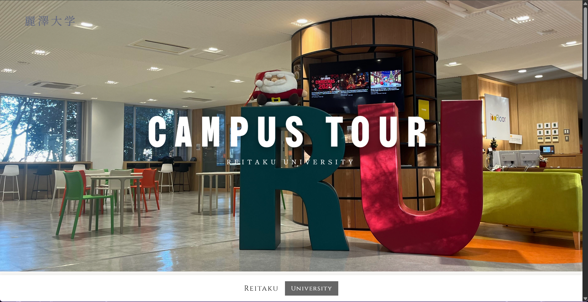
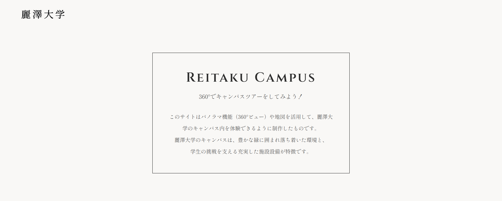
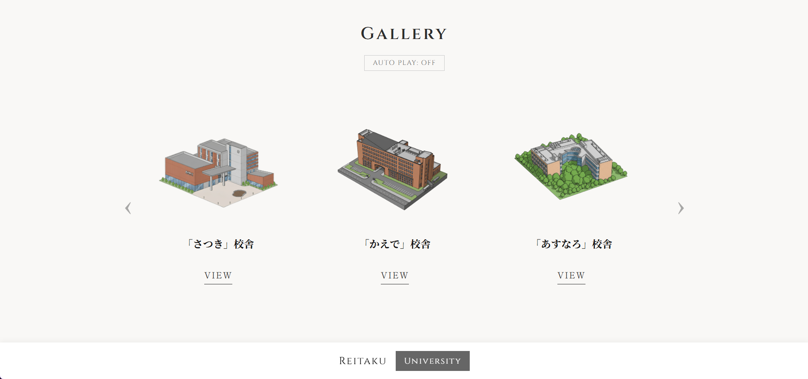
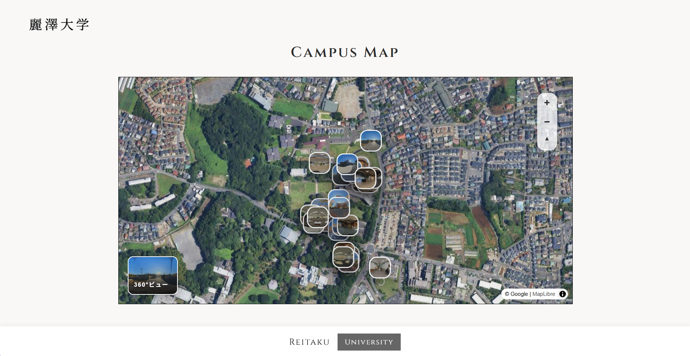
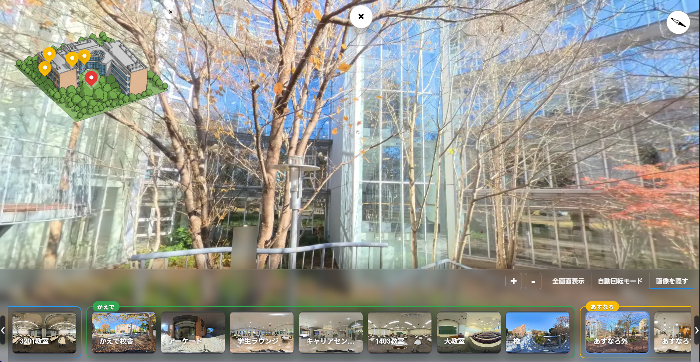

<h1 align="center">🌳 Reitaku Campus</h1>

    

    
    

    
    

---

# About

## こんにちは！

本サイト<a href="https://reitaku-campus.pages.dev/">麗澤Campus</a>はこのレポジトリをもとに作成されました。
このサイトは2025年度、秋学期　工学部1年　初年次ゼミ　河野洋ゼミの活動の一環として制作されたものです。

このサイトを作ったきっかけは、学外の学生さんや教育関係者などに少しでも麗澤大学の魅力を伝えたいと思ったためです！
 
「麗澤のリアルな風景が知りたい！」「どんな雰囲気なんだろう？」
という方のために
*360°写真風*でいつ、どこでも”見る”ことができるサイトとなっています。

ぜひ、使ってみてください！

 

